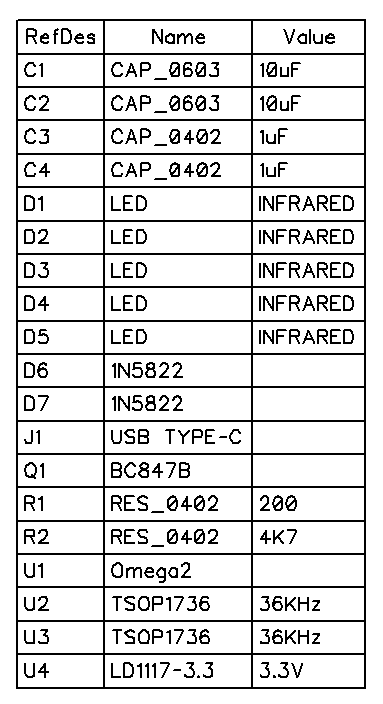
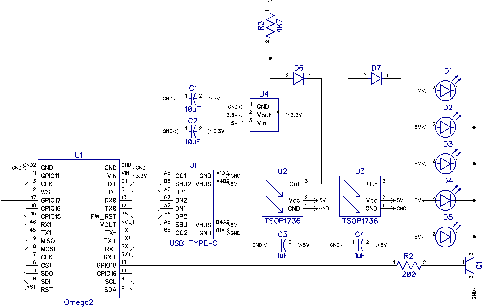

# RC-Transceiver
IR remote control receiver and transmitter based on Onion Omega2


## Hardware

### Bill of materials


### Schematic



## Software

RC-transceiver uses it's own Linux kernel module. This module uses the hardware PWM of Onion Omega2 for IR transmitting and GPIO for receiving.

### How to load the Linux kernel module

You can load the module via command line:
`insmod rc-transceiver rx_pin=16 pwm_channel=0`
You should use this parameters for my schematic but if you want to change something:
* rx_pin - number of GPIO pin for receiving
* pwm_channel - PWM channel used for transmitting (0 for pin 18, 1 for pin 19, see datasheet)

To load the module autocatically at boot you can create the `/etc/modules.d/99-rc-transceiver` file with this line:
```
rc-transceiver rx_pin=16 pwm_channel=0
```
**You need to set GPIO MUX to PWM manually**, e.g. put this line to the beginning of `/etc/rc.local`:
```
omega2-ctrl gpiomux set pwm0 pwm
```

### How to use the Linux kernel module
If module is loaded correctly the `/dev/rc` pseudo file should appear. You can read it as a text file and press some button on your remote control:
```
root@rc-transceiver:~# cat /dev/rc
680a7803bc017803bc01bc01bc01bc01bc0178037803bc01bc01bc01bc01bc01bc01bc01bc01bc01bc01bc01bc01bc0178037803bc01bc017803bc01bc01bc01bc01bc01bc0178037803
```
This long line is a raw button code. It's encoded as a hexadecimal string of 16-bit (little-endian) values with signal lengths and gap lengths in microseconds. E.g. code `112233445566778899aa` means:
* `1122` = 8721 microseconds of signal
* `3344` = 17459 microseconds of gap
* `5566` = 26197 microseconds of signal
* `7788` = 34935 microseconds of gap
* `99aa` = 43673 microseconds of signal
And so on.
So [RC-6](https://www.sbprojects.net/knowledge/ir/rc6.php)-encoded button 0x3D looks like `680a7803bc017803bc01bc01bc01bc01bc0178037803bc01bc01bc01bc01bc01bc01bc01bc01bc01bc01bc01bc01bc0178037803bc01bc017803bc01bc01bc01bc01bc01bc0178037803`

Now you can transmit this code by writing to the `/dev/rc`:
```
echo 680a7803bc017803bc01bc01bc01bc01bc0178037803bc01bc01bc01bc01bc01bc01bc01bc01bc01bc01bc01bc01bc0178037803bc01bc017803bc01bc01bc01bc01bc01bc0178037803 > /dev/rc
```

## Example scripts
This project comes with several Python scripts that demonstrate encoding and decoding of some remote control protocols:
* `demo_scripts/receiver-test.py` - receiver
* `demo_scripts/transmitter-test.py` - transmitter
* `demo_scripts/necrc.py` - module to decode and encode NEC protocol (most popular one)
* `demo_scripts/rc6.py` - module to decode and encode RC-6 protocol (used by Philips)

## Donations

* YooMoney: [41001843680639](https://yoomoney.ru/transfer/quickpay?requestId=343838343938323238305f64633138343335353537313930333165656235636336346136363334373439303432636264356532)
* Bitcoin: [1GS4XXx1FjQaFjgHnoPPVAzw9xqfv5Spx5](https://btc.clusterrr.com/)
* DonationAlerts: [https://www.donationalerts.com/r/clustermeerkat](https://www.donationalerts.com/r/clustermeerkat)
